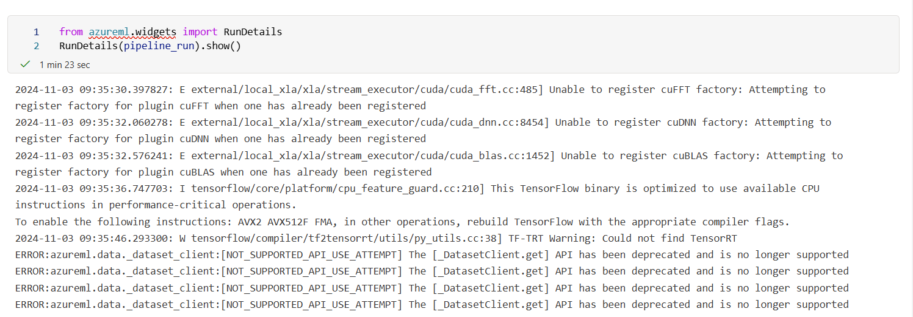

# Operationalizing Machine Learning
In this project, I will work with the Bank Marketing datase. Using Azure to configure a cloud-based machine learning production model, deploy it, and consume it.I'll also create, publish, and consume a pipeline. In the end, you will demonstrate all of your work by creating a README file and a screencast video.

## Architectural Diagram

## Key Steps
### Automate ML Experience
Banking Dataset

Best Model

Deploy Model

Application Insight enabled

Logs output

Swagger UI

Using endpoint.py script

Pipeline job

Running Widget
The API of AzureML is deprecated so N/A

Succeed pipeline

Pipeline endpoint

## Screen Recording
[Screencast](https://drive.google.com/file/d/1hc7865UD6h2Xap3dvzXeoR1EPdlECHxw/view?usp=sharing)

## Standout Suggestions
*TODO (Optional):* This is where you can provide information about any standout suggestions that you have attempted.
